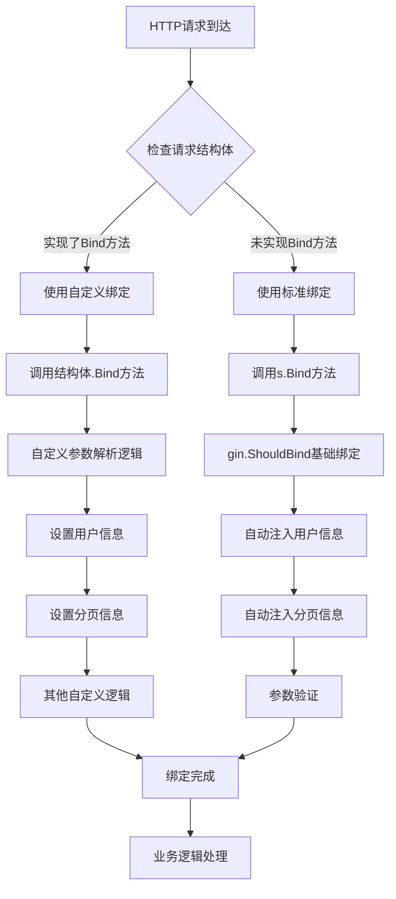

# Go-mir框架的参数绑定和响应渲染机制详解

## 概述

在paopao-ce项目中，`_binding_`和`_render_`是基于[go-mir](https://github.com/alimy/mir)框架生成的接口类型，用于实现统一的HTTP请求参数绑定和响应渲染机制。这不是gin框架的原生能力，而是go-mir为了简化API开发而设计的抽象层。

## 1. 什么是go-mir框架

go-mir是一个基于结构体标签（struct tags）自动生成HTTP API代码的Go框架。它可以：

1. **自动生成路由代码**：根据结构体定义自动生成gin路由处理器
2. **统一参数绑定**：提供一致的请求参数绑定接口
3. **统一响应渲染**：提供一致的响应数据渲染接口
4. **减少样板代码**：避免手写重复的HTTP处理逻辑

## 2. _binding_接口详解

### 2.1 接口定义

在自动生成的代码中（如`auto/api/v1/loose.go`），你会看到：

```go
// 这是go-mir自动生成的接口定义
type _binding_ interface {
    Bind(*gin.Context) error
}
```

### 2.2 接口作用

`_binding_`接口定义了一个标准的参数绑定方法，任何实现了这个接口的结构体都可以：

1. **自定义绑定逻辑**：不仅仅是简单的JSON/Form绑定
2. **参数验证**：在绑定过程中进行复杂的参数验证
3. **数据预处理**：在绑定后对数据进行额外处理
4. **权限检查**：在绑定过程中检查用户权限

### 2.3 使用方式

在生成的路由代码中，你会看到两种绑定模式：

#### 模式一：标准绑定（使用Service的Bind方法）
```go
// GET /v1/user/posts 使用这种模式
req := new(web.GetUserTweetsReq)
if err := s.Bind(c, req); err != nil {
    s.Render(c, nil, err)
    return
}
```

#### 模式二：自定义绑定（使用结构体的Bind方法）
```go
// GET /v1/posts 使用这种模式
req := new(web.TimelineReq)
var bv _binding_ = req  // 类型断言为_binding_接口
if err := bv.Bind(c); err != nil {
    s.Render(c, nil, err)
    return
}
```

## 3. 两种绑定模式的区别

### 3.1 标准绑定模式

```go
// 使用Service的通用Bind方法
if err := s.Bind(c, req); err != nil {
    s.Render(c, nil, err)
    return
}
```

**特点：**
- 使用`internal/servants/base/base.go`中的`bindAny`函数
- 提供通用的绑定逻辑：JSON/Form参数绑定、用户信息注入、分页信息设置
- 适用于大多数标准场景

**实现逻辑（在base/base.go中）：**
```go
func bindAny(c *gin.Context, obj any) error {
    var errs xerror.ValidErrors
    // 1. 使用gin的ShouldBind进行基础绑定
    err := c.ShouldBind(obj)
    if err != nil {
        return mir.NewError(xerror.InvalidParams.StatusCode(), xerror.InvalidParams.WithDetails(errs.Error()))
    }
    
    // 2. 自动注入用户信息（如果结构体实现了UserSetter接口）
    if setter, ok := obj.(UserSetter); ok {
        user, _ := UserFrom(c)
        setter.SetUser(user)
    }
    
    // 3. 自动注入用户ID（如果结构体实现了UserIdSetter接口）
    if setter, ok := obj.(UserIdSetter); ok {
        uid, _ := UserIdFrom(c)
        setter.SetUserId(uid)
    }
    
    // 4. 自动设置分页信息（如果结构体实现了PageInfoSetter接口）
    if setter, ok := obj.(PageInfoSetter); ok {
        page, pageSize := app.GetPageInfo(c)
        setter.SetPageInfo(page, pageSize)
    }
    
    return nil
}
```

### 3.2 自定义绑定模式

```go
// 使用结构体自己的Bind方法
var bv _binding_ = req
if err := bv.Bind(c); err != nil {
    s.Render(c, nil, err)
    return
}
```

**特点：**
- 结构体实现自己的`Bind(c *gin.Context) error`方法
- 可以实现完全自定义的绑定逻辑
- 适用于有特殊需求的场景

**实现示例（TimelineReq.Bind方法）：**
```go
func (r *TimelineReq) Bind(c *gin.Context) error {
    // 1. 获取并设置用户信息
    user, _ := base.UserFrom(c)
    r.BaseInfo = BaseInfo{
        User: user,
    }
    
    // 2. 获取分页信息
    r.Page, r.PageSize = app.GetPageInfo(c)
    
    // 3. 自定义参数解析逻辑
    r.Query, r.Type, r.Style = c.Query("query"), "search", c.Query("style")
    
    return nil
}
```

## 4. _render_接口详解

### 4.1 接口定义

```go
type _render_ interface {
    Render(*gin.Context)
}
```

### 4.2 使用方式

某些响应结构体实现了自定义的渲染逻辑：

```go
resp, err := s.Timeline(req)
if err != nil {
    s.Render(c, nil, err)
    return
}
// 使用响应结构体自己的Render方法
var rv _render_ = resp
rv.Render(c)
```

## 5. 实际应用场景分析

### 5.1 为什么TimelineReq使用自定义绑定？

```go
// TimelineReq的特殊处理
func (r *TimelineReq) Bind(c *gin.Context) error {
    user, _ := base.UserFrom(c)
    r.BaseInfo = BaseInfo{User: user}
    r.Page, r.PageSize = app.GetPageInfo(c)
    
    // 特殊逻辑：强制设置Type为"search"
    r.Query, r.Type, r.Style = c.Query("query"), "search", c.Query("style")
    return nil
}
```

**原因分析：**
1. **特殊的参数处理逻辑**：Type参数被硬编码为"search"
2. **简化前端调用**：前端不需要传递type参数
3. **向后兼容**：保持API接口的稳定性

### 5.2 标准绑定的应用场景

```go
// GetUserTweetsReq使用标准绑定
type GetUserTweetsReq struct {
    BaseInfo `form:"-" binding:"-"`
    Username string `form:"username" binding:"required"`
    Style    string `form:"style"`
    Page     int    `form:"-" binding:"-"`
    PageSize int    `form:"-" binding:"-"`
}
```

**使用标准绑定的原因：**
1. **标准的参数映射**：直接从HTTP参数映射到结构体字段
2. **无特殊逻辑**：不需要额外的参数处理
3. **利用自动注入**：自动获取用户信息和分页参数

## 6. 完整的绑定流程图



## 7. 绑定机制的设计优势

### 7.1 统一性
- 所有API都使用相同的绑定模式
- 减少开发者的学习成本
- 便于维护和扩展

### 7.2 灵活性
- 可以选择标准绑定或自定义绑定
- 支持复杂的参数处理逻辑
- 易于扩展新的绑定功能

### 7.3 自动化
- 自动注入用户信息和分页参数
- 自动进行参数验证
- 减少重复代码

## 8. 最佳实践

### 8.1 何时使用自定义绑定

```go
// ✅ 推荐使用自定义绑定的场景
type SpecialReq struct {
    BaseInfo `form:"-" binding:"-"`
    // 需要特殊处理的参数
}

func (r *SpecialReq) Bind(c *gin.Context) error {
    // 1. 复杂的参数转换逻辑
    // 2. 特殊的权限检查
    // 3. 参数的预处理
    // 4. 向后兼容的参数映射
    return nil
}
```

### 8.2 何时使用标准绑定

```go
// ✅ 推荐使用标准绑定的场景
type StandardReq struct {
    BaseInfo `form:"-" binding:"-"`
    Name     string `form:"name" binding:"required"`
    Age      int    `form:"age" binding:"min=1,max=120"`
}

// 不需要实现Bind方法，使用默认的s.Bind(c, req)
```

### 8.3 错误处理最佳实践

```go
func customBind(c *gin.Context) error {
    // 参数验证失败时返回合适的错误
    if someValidation {
        return mir.NewError(400, "参数验证失败")
    }
    
    // 权限检查失败时返回合适的错误
    if !hasPermission {
        return mir.NewError(403, "无权限访问")
    }
    
    return nil
}
```

## 9. 总结

`_binding_`机制是paopao-ce项目基于go-mir框架构建的请求处理抽象层，它提供了：

1. **统一的接口标准**：所有请求都通过相同的绑定接口处理
2. **灵活的实现方式**：支持标准绑定和自定义绑定两种模式
3. **自动化的辅助功能**：自动注入用户信息、分页参数等
4. **可扩展的架构**：易于添加新的绑定逻辑和验证规则

这种设计模式在大型Web应用中非常有用，它将重复的HTTP处理逻辑抽象化，让开发者可以专注于业务逻辑的实现，同时保证了代码的一致性和可维护性。

## 参考资料

- [go-mir项目地址](https://github.com/alimy/mir)
- [gin框架文档](https://gin-gonic.com/)
- [paopao-ce架构设计文档](../docs/proposal/22112309-关于paopao-ce的结构设计.md) 